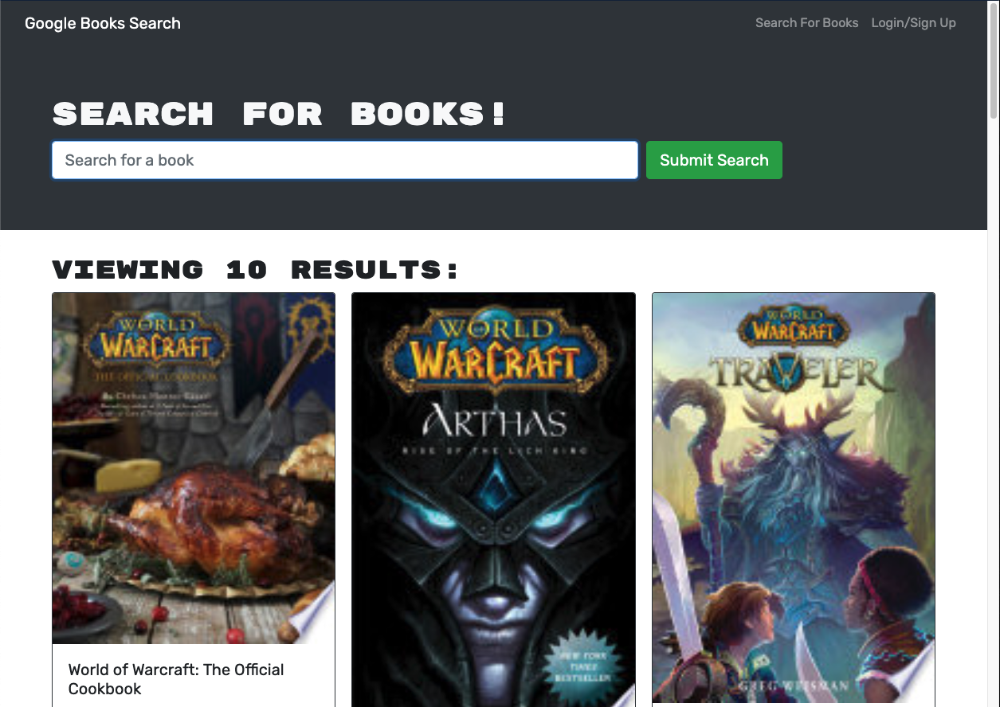

# Good Reads 

## Description
Good Reads uses the Google Books Search API with a React front-end that allows a user to search for books via keywords and add them to their 'saved books' section.

## Table of Contents
- [Installation](#Installation)
- [Usage](#Usage)
- [License](#License)

## Installation
No installation is necessary to use the application. Please visit the URL provided in this Readme!

## Usage
Good Reads allows Users to search for a subject, book title, or random keyword to find books related to that search query. Once books have populated, Users can save whatever book title they choose to reference later.

## License
This application is under the MIT license.

## Deployed Application
https://clu-good-reads.herokuapp.com/

## Screenshot

## Questions
Github: https://www.github.com/Clu-Codes
If you have additional questions, please feel free to reach out to me at Clu.Codes@gmail.com.
